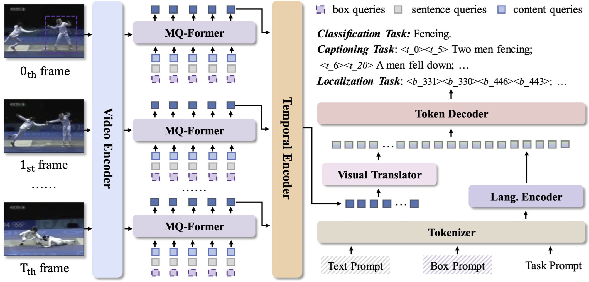
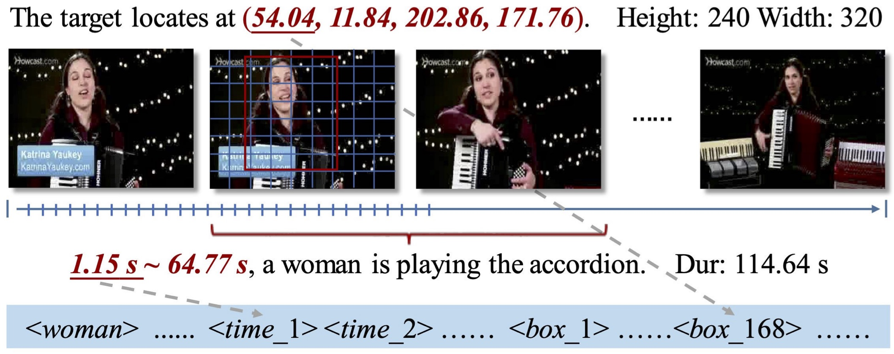
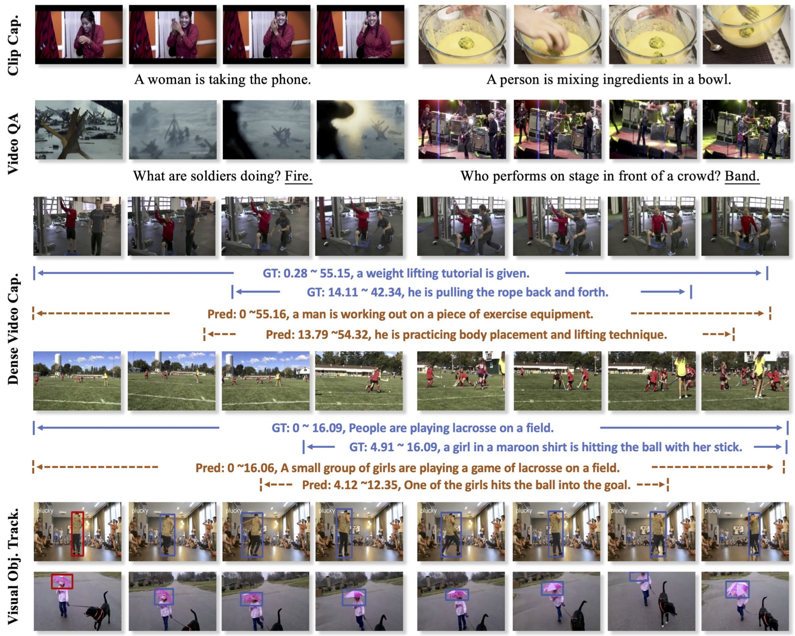

# OmniVid: A Generative Framework for Universal Video Understanding

Official PyTorch implementation of the following paper:

OmniVid: A Generative Framework for Universal Video Understanding, CVPR 2024.

Junke Wang<sup>1,2</sup>, Dongdong Chen<sup>3</sup>, Chong Luo<sup>4</sup>, Bo He<sup>5</sup>, Lu Yuan<sup>3</sup>, Zuxuan Wu<sup>1,2</sup>, Yu-Gang Jiang<sup>1,2</sup>
\
<sup>1</sup>Shanghai Key Lab of Intell. Info. Processing, School of CS, Fudan University \
<sup>2</sup>Shanghai Collaborative Innovation Center of Intelligent Visual Computing \
<sup>3</sup>Microsoft Cloud + AI, <sup>4</sup>Microsoft Research Asia, <sup>5</sup>University of Maryland, College Park  

--- 

<p align="center">

</p>

The core of video understanding tasks, such as recognition, captioning, and tracking, is to automatically detect objects or actions in a video and analyze their temporal evolution. Despite sharing a common goal, different tasks often rely on distinct model architectures and annotation formats. In contrast, natural language processing benefits from a unified output space, *i.e.*, text sequences, which simplifies the training of powerful foundational language models, such as GPT-3, with extensive training corpora. 

<p align="center">

</p>

Inspired by this, we seek to unify the output space of video understanding tasks by using languages as labels and additionally introducing *time* and *box* tokens. In this way, a variety of video tasks could be formulated as video-grounded token generation. This enables us to address various types of video tasks, including classification (such as action recognition), captioning (covering clip captioning, video question answering, and dense video captioning), and localization tasks (such as visual object tracking) within a fully shared encoder-decoder architecture, following a generative framework. Through comprehensive experiments, we demonstrate such a simple and straightforward idea is quite effective and can achieve state-of-the-art or competitive results on seven video benchmarks, providing a novel perspective for more universal video understanding.

## Training and Inferene

Will be released soon.

## Visualizations

<p align="center">

</p>


## Citation
If you find this repository helpful, please consider citing:
```
@inproceedings{wang2024omnivid,
  title={OmniVid: A Generative Framework for Universal Video Understanding},
  author={Wang, Junke and Chen, Dongdong and Luo, Chong and He, Bo and Yuan, Lu and Wu, Zuxuan and Jiang, Yu-Gang},
  booktitle={CVPR},
  year={2024}
}
```
